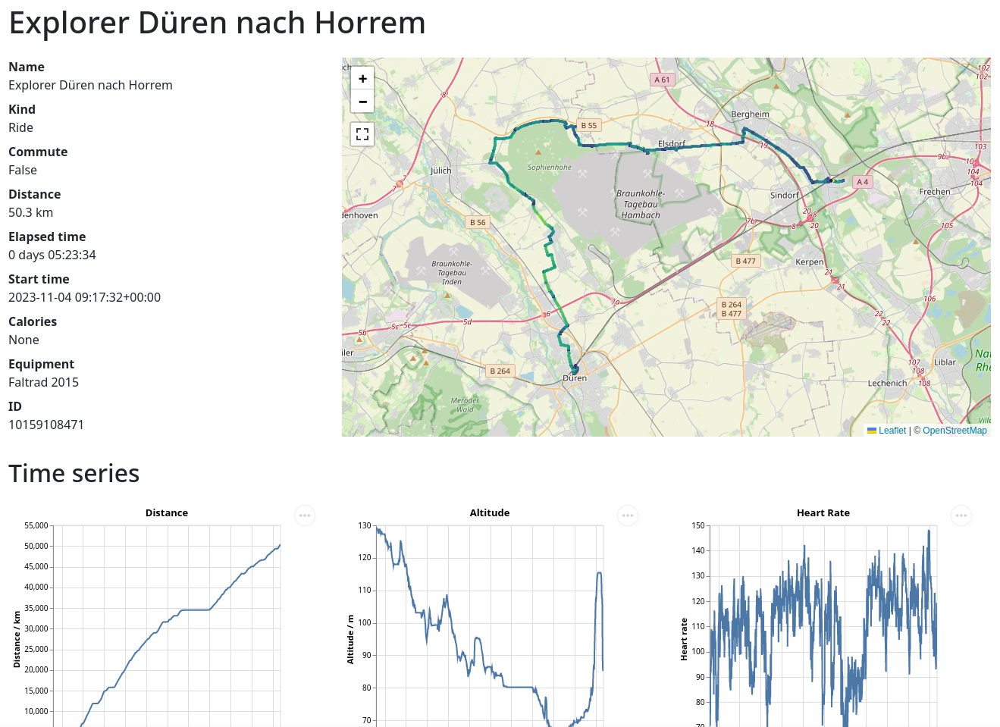
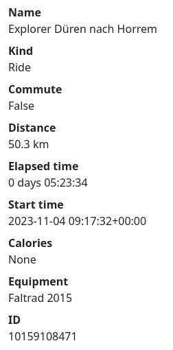
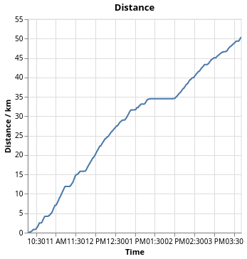
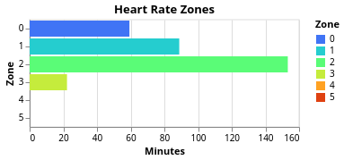

# Activity View

When you have selected a particular activity, you can view various details about it. This is what the screen looks like, we will go through the different parts in the following.

## Metadata

You have a column with metadata about the activity. The activity kind, whether it is a commute and the equipment are currently only supported via the Strava API, but we can build something to infer that from directories as well.

The calories are broken in the Strava API wrapper library that I use, therefore they don't show even if they are there.

You can also see the ID which is an internal ID. When you use Strava API as a source, it will use the IDs that Strava gives. When you use files from a directory it will be computed from a hash of the path to the activity file.

## Map with track

The interactive map shows a line with the activity. The speed is color-coded and peaks at 35 km/h with a yellow color.

## Time series plots

Then there are a couple of time series plots. One is the distance vs. time. You can see how much distance you covered when and also see plateaus when you went on a break.

If the time series data has the altitude, which isn't always the case, you can see it in the plot there. Here we can see how I did a tour and continually rode downhill. Except at the end where I had to climb in order to get the explorer tile that I wanted.

The heart rate isn't too helpful, I feel. Still I've created the plot from the given data.

## Heart rate zones

More interesting regarding the heart rate are the zones which one has spent time during this activity.

There are some common definitions of _heart rate zones_, take for instance [this one by Polar](https://www.polar.com/blog/running-heart-rate-zones-basics/). There are five zones, namely from 50 to 60 %, 60 to 70 %, 70 to 80 %, 80 to 90 % and 90 to 100 % of the maximum heart rate. The maximum heart rate would need to be measured, but taking the formula _220 - age_ will do for most people.

On [this blog](https://theathleteblog.com/heart-rate-zones/) there are also some names given to the zones, the same way that my Garmin watch does it:

Zone | Heart Rate | Training
---: | ---: | ---:
1 | 50 to 60 % | Warmup
2 | 60 to 70 % | Light
3 | 70 to 80 % | Aerob
4 | 80 to 90 % | Intensiv
5 | 90 to 100 % | Maximal

One can [find slightly different zone definition](https://www.rei.com/learn/expert-advice/how-to-train-with-a-heart-rate-monitor.html).

For this to work you need to enter your birth year into the [configuration file](../getting-started/config-file.md). If you are not satisfied with the _220 minus age_ prescription, please let me know. We can make this more flexible.