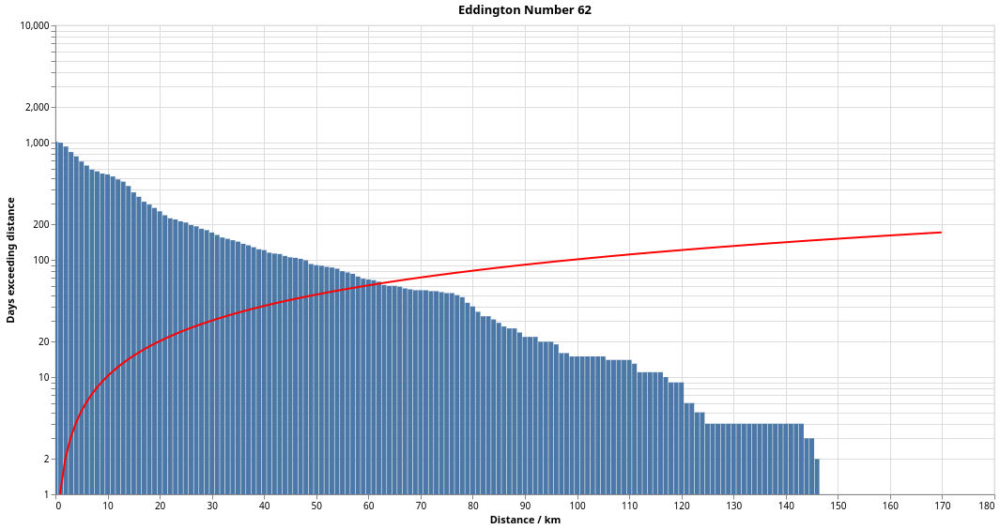

# Eddington Number

The astronomer Sir Arthur Eddington like to go on longer bike rides. Apparently he did a lot of rides and had 84 days where he rode at least 84 miles. The [Eddington number for cycling](https://en.wikipedia.org/wiki/Arthur_Eddington#Eddington_number_for_cycling) was coined from this.

If you have an Eddington number E, it means that you have had E days with at least E kilometer distance. At the time of writing my number is 62, which means that I rode at least 62 km on 62 separate days. If I want to extend it to 63, I would need to have at least 63 km on 63 separate days. My bike rides that are just 62 km long will not count any more, making this challenge really hard.

In the following plot you can see in blue the number of days that exceed the given distance. You can see that I have a 998 days that exceed 1 km, that's pretty easy when one just records enough data over many years. But then there are only 259 days where I exceed 20 km as this is beyond the distance that I have when I only go for a walk or run some simple errands.

The red curve indicates how many rides one needs to get the Eddington number. As it is a semi-log plot, the straight line is curved like a log-curve.

You can see this cliff at around 80 km. That is the distance that I ride to work and back. I have many days with around 80 km, but longer rides are only on occasional bike trips. Therefore I think I will eventually make it to an Eddington number of 80, but beyond that will be super difficult.

This is a life-long challenge, so who knows what happens in the future.

## Length unit

The definition of the Eddington number depends on the length unit that one has. Eddington as a British person used the English mile as a base unit. Therefore his number of 84 is actually harder to achieve than a 84 based on kilometers because he needed to exceed 135 km (84 mi) on each ride.

Therefore using a different length unit as a base changes the meaning. The kilometer is easier, the mile (1609.344 m) is harder. One could also use nautical miles (1852 m). And while we are at arbitrary unit systems, we could also use furlongs (201.168 m).