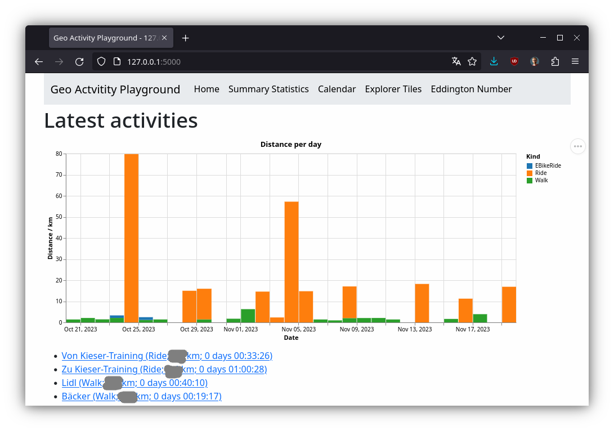

# Starting The Webserver

Before you start here, you should have done these things:

- You have installed the program either from a stable version or from git.
- You have set up a playground with either activity files or the Strava API.

Now we can start the webserver which provides most of the features. This is done with the `serve` command. So depending on how you have installed it, the commands could look like these:

- `geo-activity-playground --source strava-api serve` if you are in the playground directory and have installed a stable version.
- `poetry run geo-activity-playground --basedir ~/Dokumente/Karten/Playground serve` if you have it from the git checkout and want to use local files in your directory as a data source.

The webserver will start up and give you a bit of output like this:

```
2023-11-19 17:59:23 geo_activity_playground.importers.strava_api INFO Loading metadata file …
2023-11-19 17:59:23 stravalib.protocol.ApiV3 INFO GET 'https://www.strava.com/api/v3/athlete/activities' with params {'before': None, 'after': 1700392964, 'page': 1, 'per_page': 200}
2023-11-19 17:59:23 geo_activity_playground.importers.strava_api INFO Checking for missing time series data …
 * Serving Flask app 'geo_activity_playground.webui.app'
 * Debug mode: off
2023-11-19 17:59:23 werkzeug INFO WARNING: This is a development server. Do not use it in a production deployment. Use a production WSGI server instead.
 * Running on http://127.0.0.1:5000
2023-11-19 17:59:23 werkzeug INFO Press CTRL+C to quit
```

The warning about the development server is fine. We are using this only to play around, not to power a web service for other users.

Open <http://127.0.0.1:5000> to open the website in your browser. There might be some more messages about downloading and parsing data. The first startup will take quite some time. When it is done you will see something like this:



Click around and explore the various features.