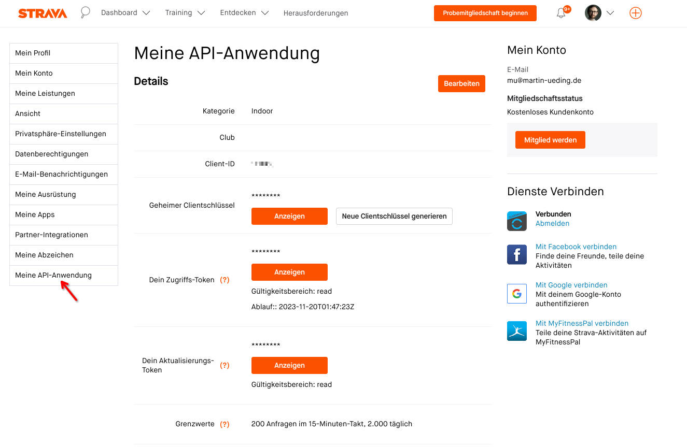

# Using Strava API

You might have all your data on the Strava service and would like to use this for additional analytics without moving your data. That is fine.

In order to use the Strava API, one needs to create an app. If my explanation doesn't suit you, have a look [at this how-to guide](https://towardsdatascience.com/using-the-strava-api-and-pandas-to-explore-your-activity-data-d94901d9bfde) as well.

Navigate to the [API settings page](https://www.strava.com/settings/api) and create an app. It only needs to have read permissions.

After you are done with that, you can see your App here:



There is a client ID that we are going to need for the next step. In general our app could be used by all sorts of people who can then access _their_ data only. We want to access our own data, but we still need to authorize our app to use our data. In order to get this token, we need to visit the following URL, with `{client_id}` replaced by your ID.

```
https://www.strava.com/oauth/authorize?client_id={client_id}&redirect_uri=http://localhost&response_type=code&scope=activity:read_all
```

This will prompt an OAuth2 request where you have to grant permissions to your app. After that you will be redirected to localhost and see a “page not found” error. That is all okay!

Take a look at the URL. It look like this:

```
http://localhost/?state=&code={code}&scope=read,activity:write,activity:read_all
```

From the URL you can read off the _code_. Now you have all the three data points that you need. Create the file `Playground/config.toml` with a text editor and fill in this template:

```toml
[strava]
client_id = "…"
client_secret = "…"
code = "…"
```

Add the _client ID_ and the _client secret_ from your Strava app. Add the _code_ that we have read off this localhost URL.

Then you are all set to download data from the Strava API.

## Rate limiting

When you first start this program and use the Strava API as a data source, it will download the metadata for all your activities. Then it will start to download all the time series data for each activity. Strava has a rate limiting, so after the first 200 activities it will crash and you will have to wait for 15 minutes until you can try again and it will download the next batch.